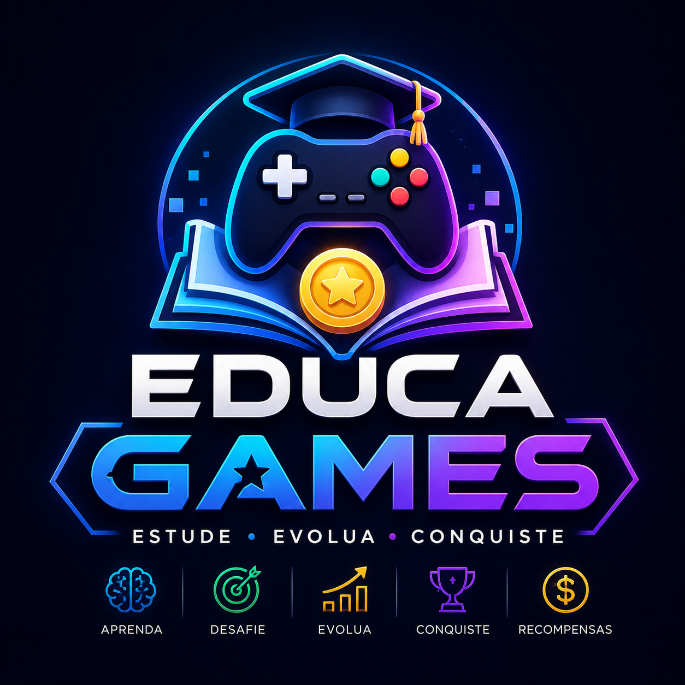

<div align="center">
  
  <h1>EducaGames 🎮</h1>
  <p><strong>A Próxima Geração da Educação Gamificada</strong></p>

  <p>
    
    
    
    
    
  </p>

  <p align="center">
    <i>Transformando o aprendizado em uma jornada épica de conquistas, níveis e recompensas.</i>
  </p>
</div>

---

## ✨ Visão Geral

**EducaGames** é uma plataforma educacional completa desenvolvida para o Trabalho de Conclusão de Curso (TCC). Ela utiliza mecânicas de jogos para aumentar o engajamento dos alunos, oferecendo um ecossistema onde o estudo gera XP, moedas e reconhecimento.

---

## 🚀 Funcionalidades Principais

### 🎮 Gamificação de Elite
- **Sistema de XP e Níveis:** Progressão quadrática balanceada (fácil no início, desafiador no final).
- **Ranking Global:** Pódio dinâmico com os melhores alunos da plataforma.
- **Streak Diário:** Mantenha a chama acesa! Bônus por dias consecutivos de estudo.
- **Conquistas (Achievements):** Desbloqueie medalhas raras por metas alcançadas.

### 🎒 Novo Sistema de Inventário & Cosméticos
- **Auras Visuais:** Personalize seu avatar com efeitos épicos (Instinto Superior, Kaioken, SSJ Blue).
- **Categorização:** Organize seus itens em Jogos, Gifts, Spotify e Cosméticos.
- **Equipamento Instantâneo:** Troque seu visual em tempo real com persistência no banco de dados.

### ⚡ Loja24 (Evento Diário)
- **Itens Rotativos:** Uma loja especial que muda todos os dias à meia-noite.
- **Raridades:** Chance de encontrar itens Lendários e Épicos por tempo limitado.
- **Design Imersivo:** Experiência visual estilo Cyberpunk/Retro-futurista.

### 📝 Conteúdo Pedagógico
- **Múltiplos Formatos:** Quiz, Múltipla Escolha, Texto, Verdadeiro/Falso e Upload de arquivos.
- **Matérias:** Matemática, Biologia, Química, Física, Português, Inglês e muito mais.
- **Missões Diárias:** Objetivos dinâmicos que resetam todos os dias.

---

## 🛠️ Stack Tecnológica

| Camada | Tecnologia |
| :--- | :--- |
| **Frontend** | React 18 + Vite |
| **Styling** | TailwindCSS + Framer Motion (Animações) |
| **State Management** | Zustand + React Query (TanStack) |
| **Backend** | Node.js + Express |
| **ORM / Banco** | Prisma + SQLite |
| **Segurança** | JWT + Refresh Tokens + Helmet + Rate Limit |

---

## 🏗️ Estrutura do Projeto

```bash
educagames/
├── client/          # 💻 Interface do Usuário (Frontend)
│   ├── src/
│   │   ├── components/  # Componentes UI (Avatar, Cards, etc.)
│   │   ├── pages/       # Dashboard, Loja24, Inventário, Atividades
│   │   └── store/       # Gerenciamento de estado (Auth/Store)
│
└── server/          # ⚙️ Motor do Sistema (Backend)
    ├── prisma/      # Banco de dados e Migrations
    ├── src/
    │   ├── controllers/ # Regras de negócio e fórmulas de XP
    │   └── routes/      # Endpoints da API REST
```

---

## 🏁 Como Começar

### 1️⃣ Método Rápido (Apenas Windows)
Basta clicar duas vezes no arquivo `start.bat` na raiz do projeto. Ele cuidará de tudo!

### 2️⃣ Instalação Manual

**Configuração do Servidor:**
```bash
cd server
npm install
npx prisma db push
node prisma/seed.js  # Popula o banco inicial
npm run dev
```

**Configuração do Cliente:**
```bash
cd client
npm install
npm run dev
```

Acesse: [http://localhost:5173](http://localhost:5173)

---

## 🔑 Contas de Demonstração

| Papel | Email | Senha |
| :--- | :--- | :--- |
| **Aluno** | `aluno@educagames.com` | `student123` |
| **Professor** | `professor@educagames.com` | `teacher123` |
| **Admin** | `admin@educagames.com` | `admin123` |

---

<div align="center">
  <p>Desenvolvido com ❤️ para transformar a educação.</p>
  <sub>© 2024 EducaGames — Sistema Gamificado de Aprendizagem</sub>
</div>
